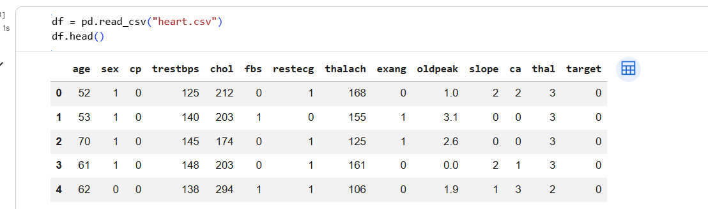
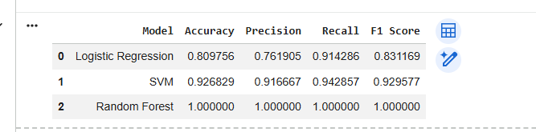
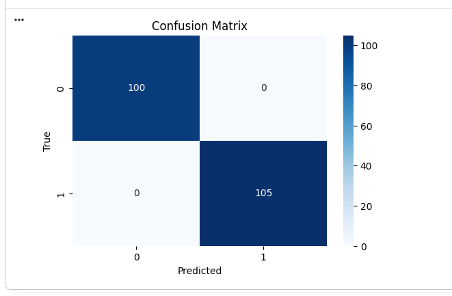
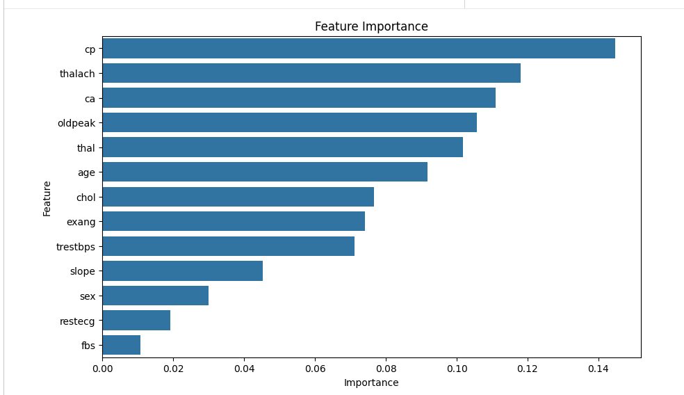

# 🫀 Disease Prediction from Medical Data

## 📌 Project Overview

This project uses Machine Learning techniques to predict the presence of heart disease based on patient medical records. Multiple classification algorithms are trained and compared to identify the most effective model for disease prediction.

The system analyzes various health parameters such as age, chest pain type, cholesterol level, blood pressure, maximum heart rate, and other clinical attributes to determine whether a patient is likely to have heart disease.

---

## 🎯 Objective

To develop an intelligent disease prediction system that can assist in early diagnosis of heart disease using machine learning classification algorithms.

---

## 📊 Dataset Information

The project uses the Heart Disease Dataset containing medical records of patients.

### Dataset Statistics

- Total Records: 1025
- Features: 13
- Target Variable: target
- Problem Type: Binary Classification

### Features

| Feature | Description |
|----------|-------------|
| age | Age of patient |
| sex | Gender |
| cp | Chest pain type |
| trestbps | Resting blood pressure |
| chol | Serum cholesterol |
| fbs | Fasting blood sugar |
| restecg | Resting ECG results |
| thalach | Maximum heart rate achieved |
| exang | Exercise-induced angina |
| oldpeak | ST depression |
| slope | Slope of ST segment |
| ca | Number of major vessels |
| thal | Thalassemia |
| target | Heart Disease (1) / No Disease (0) |

---

## ⚙️ Machine Learning Algorithms Used

- Logistic Regression
- Support Vector Machine (SVM)
- Random Forest Classifier

---

## 🔄 Project Workflow

1. Data Collection
2. Data Exploration
3. Data Preprocessing
4. Train-Test Split
5. Feature Scaling
6. Model Training
7. Model Evaluation
8. Disease Prediction
9. Performance Comparison

---

## 📈 Evaluation Metrics

The following metrics were used to evaluate model performance:

- Accuracy
- Precision
- Recall
- F1 Score
- ROC-AUC Score

---

## 📷 Project Screenshots

### Dataset Preview

### Model Comparison

### Confusion Matrix

### ROC Curve

### Feature Importance

### Sample Prediction

---

## 🏆 Results

The machine learning models were successfully trained and evaluated on the Heart Disease Dataset.

- Logistic Regression produced strong baseline performance.
- SVM achieved competitive classification results.
- Random Forest delivered the best overall performance and prediction accuracy.

Random Forest was selected as the final model for disease prediction due to its superior classification capability and robustness.

---

## 🚀 Technologies Used

- Python
- Pandas
- NumPy
- Scikit-Learn
- Matplotlib
- Seaborn
- Google Colab

---

## 📌 Future Improvements

- Deploy as a web application using Streamlit.
- Integrate real-time patient data.
- Improve prediction accuracy using advanced ensemble methods.
- Extend support for multiple diseases.

---

## 👩‍💻 Author

**Lakshmi Swapna Chandaluri**

CodeAlpha Machine Learning Internship

---

## 📜 License

This project is created for educational and internship purposes.
